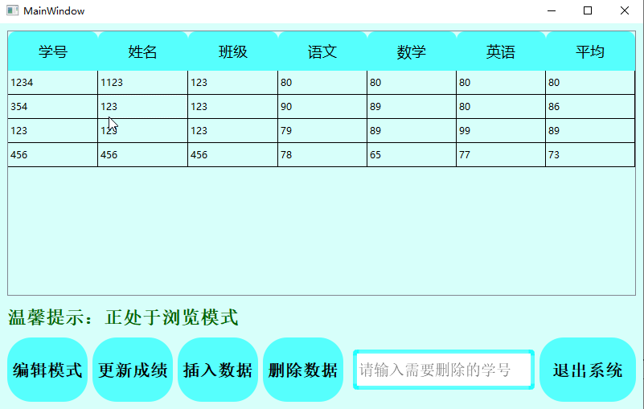
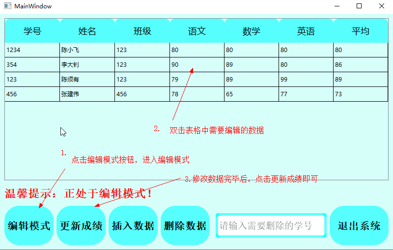
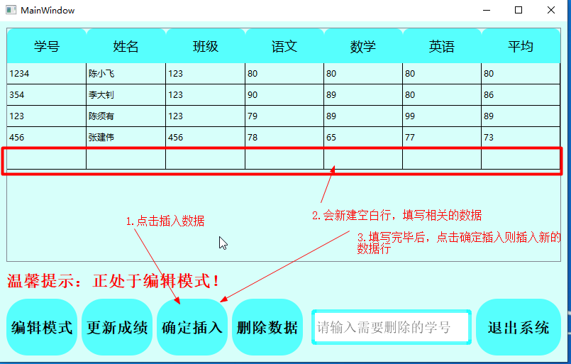
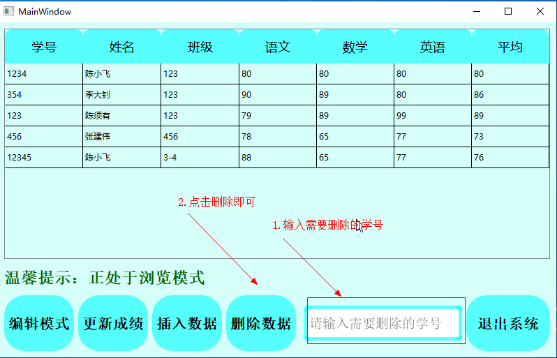
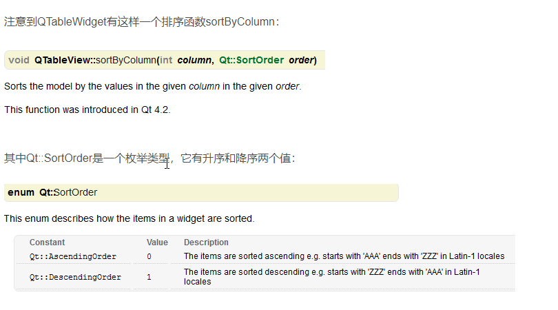

使用说明: 

```shell
1.软件第一次使用会输入账号密码会在当前文件夹中 新建一个 admin.txt 文件记录管理员密码。需要重新设置该密码，则把admin.txt 文本删除即可
```

浏览模式： 在浏览模式中无法对数据进行编辑，需要编辑数据请进入编辑模式 



编辑模式： 



插入数据模式： 



删除数据：

​    


//相关表格的设计资料

表格的设计  

create  table stu
(
id   primary key, 
name,
class,

chinese,

mat,

english

);


插入数据： 

insert  into  stu  values('123','小明','高一三班',90,90,90);


排序： 



insert  into  stu  values('12','小明','高一三班',90,90,90);

https://doc.qt.io/qt-5.12/stylesheet-reference.html  （官方技术文档）


界面的QSS设计：

 mainwindos .ui

```css
QMainWindow{background-color: qlineargradient(spread:pad, x1:0.489, y1:1, x2:0.432, y2:0.0851364, stop:0 rgba(0, 196, 180, 255), stop:1 rgba(255, 255, 255, 255));}


QPushButton {
	
	background-color: rgba(0, 255, 255, 60%); 
    border-style: solid;
    border-color: red;
    border-radius: 30px;
;}

QLineEdit{
    border-width: 5px;
    border-style: solid;
    border-color: rgba(0, 255, 255, 60%);
    border-radius: 5px;

}
```


student.ui

```css
QMainWindow{background-color: rgb(215, 255, 250);}


QPushButton {
	
	background-color: rgba(0, 255, 255, 60%); 
    border-style: solid;
    border-color: red;
    border-radius: 30px;
;}

QLineEdit#lineEdit{
    border-width: 5px;
    border-style: solid;
    border-color: rgba(0, 255, 255, 60%);
    border-radius: 5px;

}


QHeaderView
{
    background:transparent;
}

QHeaderView::section{  
	border-top-left-radius: 10px;   
    border-top-right-radius: 10px;    
    font-size:18px;            
    font-family:"Microsoft YaHei";
    color:#0;             
    background:rgba(0, 255, 255, 60%);;           
    border:none;               
    text-align:left;               
    min-height:49px;         
    max-height:49px;             
    margin-left:0px;               
    padding-left:0px;            
}

QTableWidget{
background-color:rgba(0,0,0,0)
}

```

